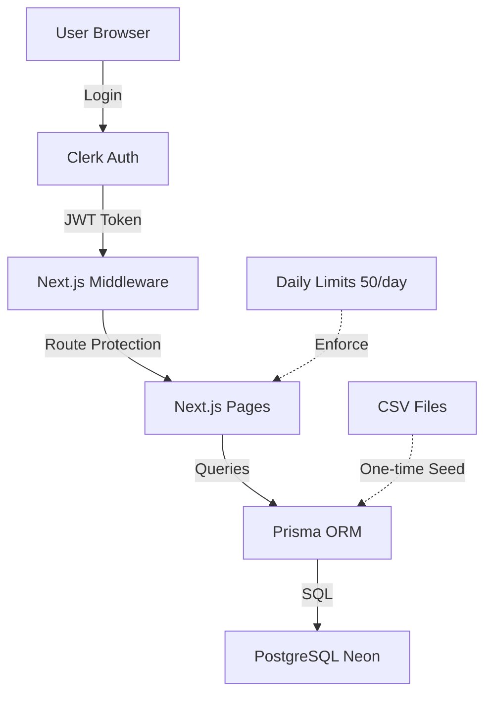

# Agency Contacts Dashboard

Professional Next.js 16 dashboard with Clerk authentication, Prisma + PostgreSQL (Neon), and daily contact view limits. Deployed on Vercel.

## Features
- 🔐 **Authentication**: Clerk with protected routes via middleware
- 📊 **Data Management**: 922 agencies, 1000 contacts from CSV import
- ⏱️ **Daily Limits**: 50 contact views/day per user with upgrade prompt
- 🎨 **Professional UI**: Navigation, tables with pagination, responsive design
- 🗄️ **Database**: PostgreSQL (Neon) with Prisma ORM

## Quick Start

### Prerequisites
- Node.js 18+
- PostgreSQL database (Neon recommended)
- Clerk account for authentication

### Installation
```bash
npm install
```


### Database Setup
```bash
# Generate Prisma Client
npx prisma generate

# Run migrations
npx prisma migrate deploy

# Seed database (agencies + contacts)
node scripts/seed.js
```

### Development
```bash
npm run dev
# Open http://localhost:3000
```

### Build
```bash
npm run build
```

## Daily Limit Behavior
- Each contact row displayed = 1 view
- 50 views per day per user
- UpgradePrompt shown when limit reached
- Resets at midnight (user's timezone)

## System Architecture

### Flow Diagram


**Architecture Flow:**
1. **User** authenticates via Clerk (sign-in/sign-up)
2. **Clerk** issues JWT session tokens
3. **Middleware** protects routes: `/dashboard`, `/agencies`, `/contacts`
4. **Next.js Pages** (App Router) query data using Prisma
5. **Prisma ORM** executes type-safe SQL queries on PostgreSQL
6. **PostgreSQL** (Neon serverless) stores 922 agencies + 1000 contacts

**Supporting Systems:**
- **CSV Import**: Initial seed via `scripts/seed.js`
- **Daily Limits**: UserContactView tracks 50 views/day per user

## Project Structure
```
app/
├── middleware.ts           # Clerk route protection
├── app/
│   ├── layout.tsx         # ClerkProvider, global styles
│   ├── page.tsx           # Landing page
│   ├── dashboard/         # Dashboard overview
│   ├── agencies/          # Agency listing (922 rows)
│   ├── contacts/          # Contact listing with pagination
│   ├── sign-in/           # Clerk sign-in
│   └── sign-up/           # Clerk sign-up
├── components/
│   ├── Navigation.tsx     # Header with auth UI
│   └── UpgradePrompt.tsx  # Limit exceeded UI
├── lib/
│   └── db.ts             # Prisma Client singleton
├── prisma/
│   ├── schema.prisma     # Database models
│   └── migrations/       # PostgreSQL migrations
└── scripts/
    └── seed.js           # CSV import script
```


``


## Tech Stack
- **Framework**: Next.js 16.0.4 (App Router, Turbopack)
- **Authentication**: Clerk 6.35.5
- **Database**: PostgreSQL (Neon) + Prisma 5.22.0
- **Styling**: Tailwind CSS 4
- **Deployment**: Vercel
- **CSV Parsing**: csv-parser


