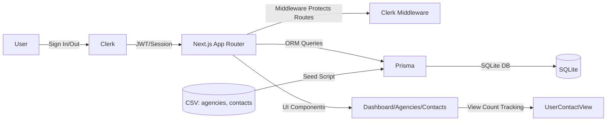

# Agency Contacts Dashboard

Professional Next.js 16 app with Clerk authentication, Prisma + SQLite, and daily contact view limits. Ready for Vercel.

## Quick Start
- Install: `npm install`
- Dev: `npm run dev`
- Seed DB: `node scripts/seed.js`

## Environment Variables
Set these on Vercel (Project Settings → Environment Variables):
- `NEXT_PUBLIC_CLERK_PUBLISHABLE_KEY`
- `CLERK_SECRET_KEY`
- `DATABASE_URL` (e.g., `file:./dev.db` for SQLite or your managed Postgres)

## Deployment (Vercel)
1. Push repo to GitHub
2. Import to Vercel → Framework: Next.js
3. Add env vars above
4. Deploy

We use Next.js App Router, Middleware for auth-protected routes, and Edge-friendly Clerk.

## Daily Limit Behavior
- Each contact row displayed = 1 view
- 50 views per day per user
- Shows UpgradePrompt when exhausted

## System Design Diagram


## Project Structure
- `app/` pages, layouts, middleware
- `components/` Navigation, UpgradePrompt
- `lib/db.ts` Prisma client
- `prisma/` schema + migrations
- `scripts/seed.js` CSV import

## Notes
- Prisma 5 for stability
- Tailwind CSS for styling
- Clerk redirects configured via Provider props

## Troubleshooting
- If limit blocks viewing: reset today’s counters
```
cd app
node -e 'const {PrismaClient}=require("@prisma/client");const p=new PrismaClient();const today=new Date().toISOString().slice(0,10);p.userContactView.deleteMany({where:{viewDate:today}}).then(r=>console.log("Deleted:",r.count)).finally(()=>p.$disconnect())'
```

Open [http://localhost:3000](http://localhost:3000) with your browser to see the result.

You can start editing the page by modifying `app/page.tsx`. The page auto-updates as you edit the file.

This project uses [`next/font`](https://nextjs.org/docs/app/building-your-application/optimizing/fonts) to automatically optimize and load [Geist](https://vercel.com/font), a new font family for Vercel.

## Learn More

To learn more about Next.js, take a look at the following resources:

- [Next.js Documentation](https://nextjs.org/docs) - learn about Next.js features and API.
- [Learn Next.js](https://nextjs.org/learn) - an interactive Next.js tutorial.

You can check out [the Next.js GitHub repository](https://github.com/vercel/next.js) - your feedback and contributions are welcome!

## Deploy on Vercel

The easiest way to deploy your Next.js app is to use the [Vercel Platform](https://vercel.com/new?utm_medium=default-template&filter=next.js&utm_source=create-next-app&utm_campaign=create-next-app-readme) from the creators of Next.js.

Check out our [Next.js deployment documentation](https://nextjs.org/docs/app/building-your-application/deploying) for more details.
