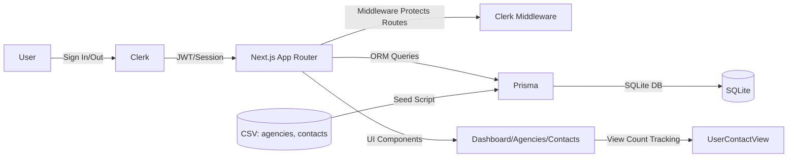

# Agency Contacts Dashboard

Professional Next.js 16 app with Clerk authentication, Prisma + SQLite, and daily contact view limits. Ready for Vercel.

## Quick Start
- Install: `npm install`
- Dev: `npm run dev`
- Seed DB: `node scripts/seed.js`

We use Next.js App Router, Middleware for auth-protected routes, and Edge-friendly Clerk.

## Daily Limit Behavior
- Each contact row displayed = 1 view
- 50 views per day per user
- Shows UpgradePrompt when exhausted

## System Design Diagram

Rendered image (for GitHub):

## Project Structure
- `app/` pages, layouts, middleware
- `components/` Navigation, UpgradePrompt
- `lib/db.ts` Prisma client
- `prisma/` schema + migrations
- `scripts/seed.js` CSV import

## Notes
- Prisma 5 for stability
- Tailwind CSS for styling
- Clerk redirects configured via Provider props

